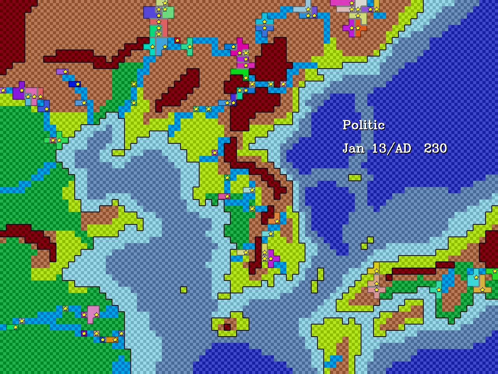
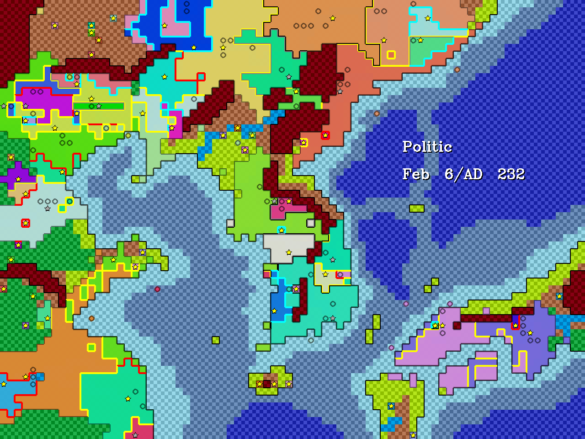
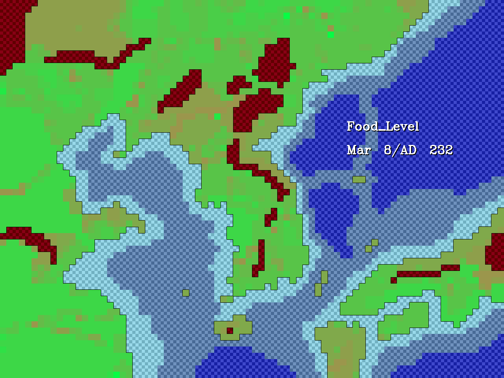
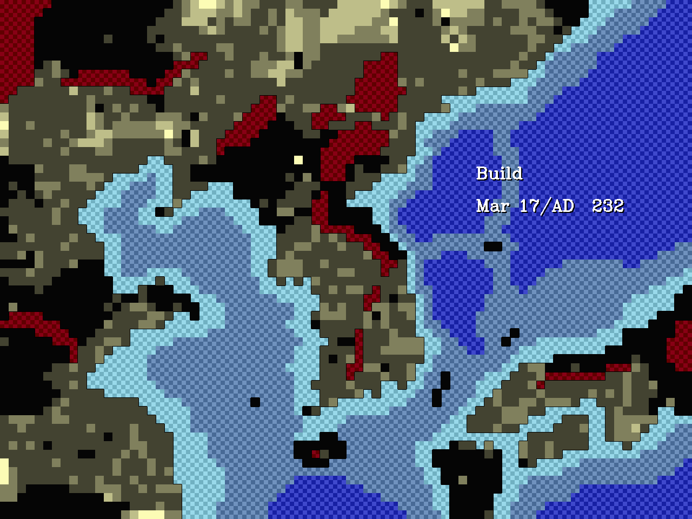
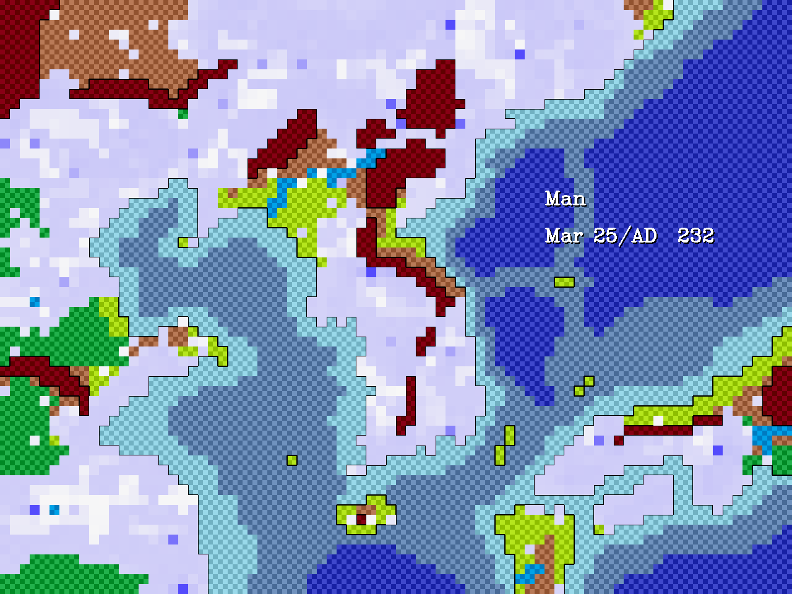
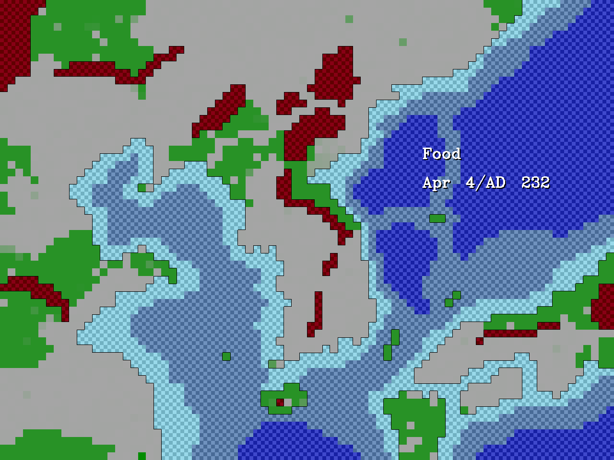
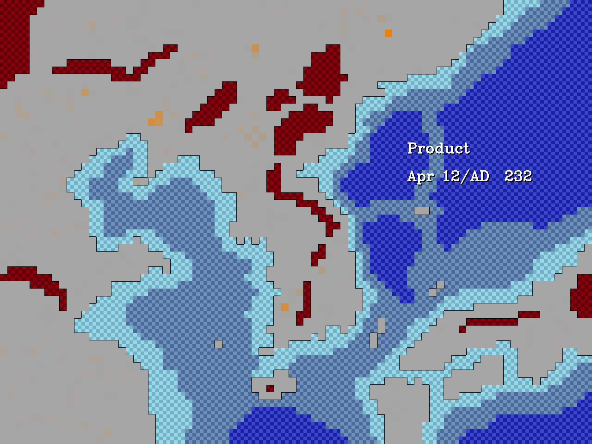
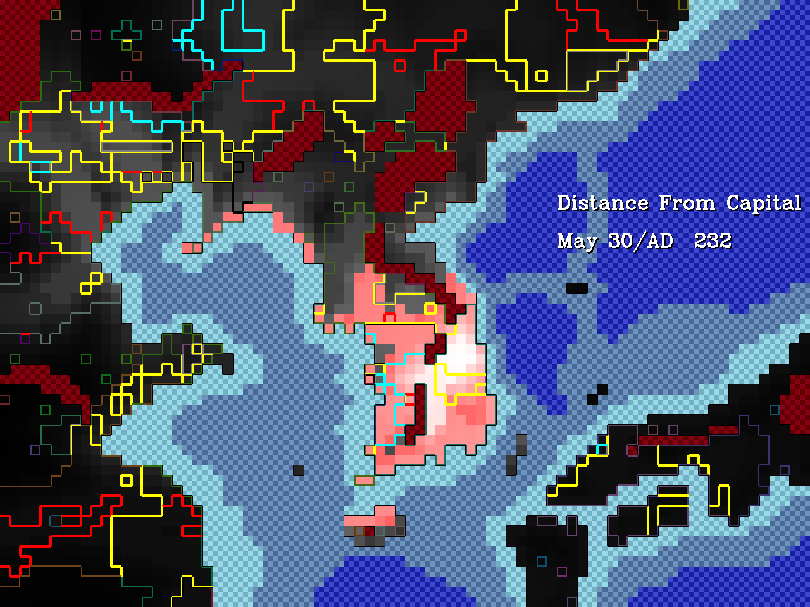

# Grid Game

제가 중학교 시절에 C#/GDI++로 만든 전쟁 게임을
C++/OpenCV로 리메이크 한 버전입니다.

## 게임 규칙

### 지형
지도 위에 다양한 지형이 있고 
바다, 연안 지역은 거주가 불가능하나 통행은 가능하고
험지 지역은 통행이 불가능 합니다.

### 국가
지도 위에 국가가 존재하고 국가는 수도로 자원을 운송합니다.
그리고 그 자원으로 국경을 확장하고 군사를 생산합니다.

### 자원
자원의 종류에는 식량, 물자, 인력이 있습니다.

식량은 인구 수를 유지하는데 사용되고
농장에 의해서 증가합니다.

물자는 농장, 건물을 유지하는데 사용되고
건물에 의해서 증가합니다.

인력은 농장, 건물을 유지하는데 사용되고
인구수에 의해서 증가합니다.

### 외교
국가간에 외교가 존재합니다.
시작할 때는 중립상태 입니다.
다른 국가가 내가 유지할 수 있는 많이 가지고 있다면 대립 상태가 됩니다.
그리고 나의 국가가 황폐하면 쇄국 상태가 됩니다. 
그리고 준비가 되었다면 전쟁을 시작할 수 있습니다. 그러나 쇄국 중인 국가에겐 전쟁을 시작 할 수 없습니다.

휴전은 수도를 점령하거나 국가가 멸망하거나 더 이상 전쟁을 진행 할 수 없을 때 시작됩니다.
국력이 차이가 많이 나지 않는다면 내가 유지할 수 있는 정도만 영토를 할양 받습니다.
그러나 국력이 압도적으로 차이가 난다면 국가를 통 채로 합병 할 수 있습니다.
휴전 기간동안에는 다시 전쟁의 시작이 불가합니다.

### 군사
군사는 전쟁을 할 때 제일 중요하게 사용됩니다.
군사는 상대 영토를 점령 할 수 있고 이 순간에 상대의 영토는 황폐해집니다.
그리고 상대의 영토의 자원의 일부를 수도에 운송합니다.

시간이 지나면서 군사는 자연소모됩니다. 

## 게임 화면

여러가지 지형을 표시한 모습입니다.
각 색깔은 해당 지형을 표시합니다.

`키를 눌러 볼 수 있습니다.

해당 영토를 점유중인 국가를 표시합니다.
국경의 색은 맞닿아 있는 국가의 외교 상태를 의미합니다.
빨강은 전쟁, 노랑은 대립, 검은색은 쇄국, 회색은 중립, 하늘색은 휴전입니다.

`키를 눌러 볼 수 있습니다.

농장의 수준을 표시해줍니다.
국가를 클릭해서 상대적인 척도로 확인 할 수 있습니다.
무주지를 클릭하면 절대적인 척도로 확인 할 수 있습니다.

1키를 눌러 볼 수 있습니다.

건물의 수준을 표시해줍니다.
국가를 클릭해서 상대적인 척도로 확인 할 수 있습니다.
무주지를 클릭하면 절대적인 척도로 확인 할 수 있습니다.

2키를 눌러 볼 수 있습니다.

인구를 표시해줍니다.
국가를 클릭해서 상대적인 척도로 확인 할 수 있습니다.
무주지를 클릭하면 절대적인 척도로 확인 할 수 있습니다.

3키를 눌러 볼 수 있습니다.

식량의 양을 표시해줍니다.
국가를 클릭해서 상대적인 척도로 확인 할 수 있습니다.
무주지를 클릭하면 절대적인 척도로 확인 할 수 있습니다.

4키를 눌러 볼 수 있습니다.

물자의 양을 표시해줍니다.
국가를 클릭해서 상대적인 척도로 확인 할 수 있습니다.
무주지를 클릭하면 절대적인 척도로 확인 할 수 있습니다.

5키를 눌러 볼 수 있습니다.

수도의 영향력을 표시해줍니다.
붉은색으로 표시된 부분은 식민지 건설이 가능한 범위를 표시합니다.

8키를 눌러 볼 수 있습니다.
